<h1 align="center">Hey, I'm Albert 👋</h1>
<h3 align="center">I build fintech and Web3 apps people actually enjoy using, from the first commit to the App Store.</h3>

  &nbsp;
  &nbsp;
  

---

## 🚀 About me

I'm a **Frontend & Mobile Engineer** from Nigeria with 5+ years of turning product ideas into fast, polished apps with **React Native, TypeScript and Next.js**.

Most of my work lives where money moves. At **DigitPay Finance** I built the mobile app from an empty repo to live on both app stores, then took it through an Expo SDK 53 → 55 upgrade across 50+ screens without a single breaking change. Along the way I've shipped real-time WebSocket updates, push notifications, Face ID and fingerprint login, escrow payments, and Web3 wallet integrations on Stellar and EVM chains.

I like startup pace, but I don't cut corners: clean architecture, reusable components, and tests on the flows that matter.

- 🔭 **Now:** Mobile Engineer @ DigitPay Finance
- 💳 **Focus:** fintech, payments, Web3, real-time apps
- 🎓 **Studying:** B.Sc. Computer Science, National Open University of Nigeria
- 🤝 **Open to:** frontend and mobile engineering roles and collaborations

---

## 🛠️ Tech stack

  
  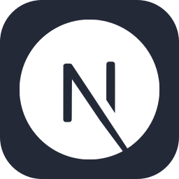
  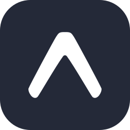
  
  
  
  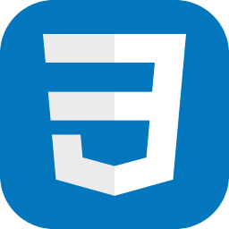
  
  

  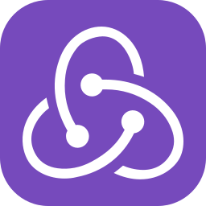
  
  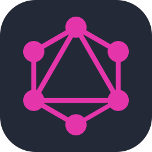
  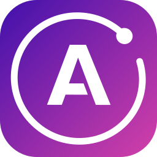
  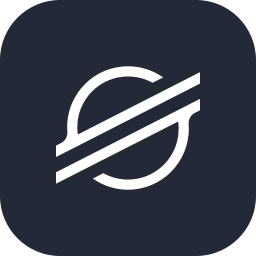

  
  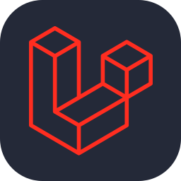
  
  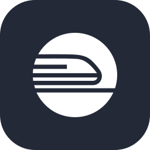
  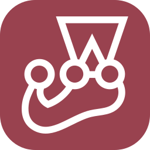
  
  
  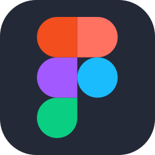

Also: Zustand · NativeWind · WebSockets · RainbowKit

---

## 💼 Experience

| Role                   | Company                             | Period            |
| ---------------------- | ----------------------------------- | ----------------- |
| Mobile Engineer        | DigitPay Finance (Remote)           | 12/2024 – Present |
| Lead Mobile Engineer   | HrPay (Freelance)                   | 07/2025 – 03/2026 |
| Lead Frontend Engineer | Paidby (Part-time)                  | 07/2024 – 03/2025 |
| Frontend Engineer      | Hackpiy Software Solutions (Remote) | 09/2023 – 06/2024 |
| Intern                 | POTTO                               | 07/2023 – 09/2023 |

**Highlights**

- Led an Expo SDK 53 → 55 migration across 50+ screens with zero breaking changes
- Built fintech features: digital wallets, airtime purchase, bill payments, and escrow payments via Paystack, Flutterwave and Seerbit
- Shipped real-time contract updates and multi-user document collaboration (Syncfusion)
- Moved hosting from DigitalOcean to Railway for faster, more scalable deployments

---

## 📂 Featured projects

- **Best Valley Ventures** — Poultry farm management system (Next.js, Material UI): task tracking, egg collection logs, cage management, sales, and an owner dashboard.
- **360 Auto** — Multi-service automotive platform (Next.js 13, Redux Toolkit, Chakra UI): geolocation-based car wash dispatch, service booking, spare-parts e-commerce, and a car marketplace.
- **SOLMANA** — Web3 token distribution platform with 960+ active users (React, TypeScript, Tailwind): user and admin dashboards for task validation and rewards.
- **Uber Education (Admin)** — Admin dashboard for an online learning platform managing students, teachers, and courses.

---

⭐ Building something in fintech or Web3? I'd love to hear about it.

